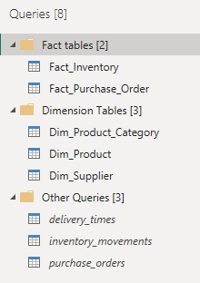
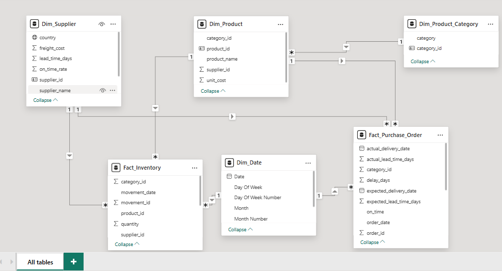
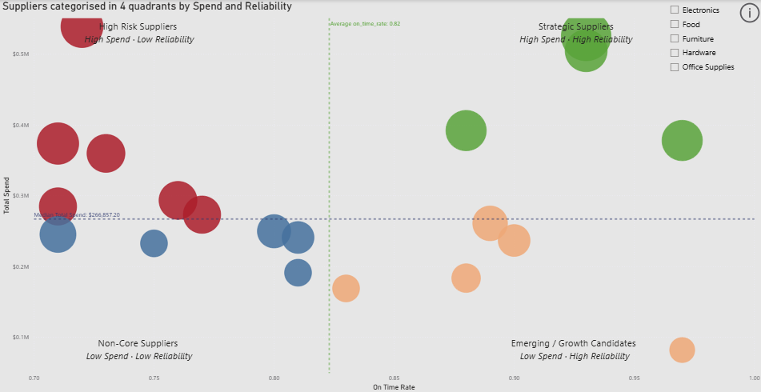
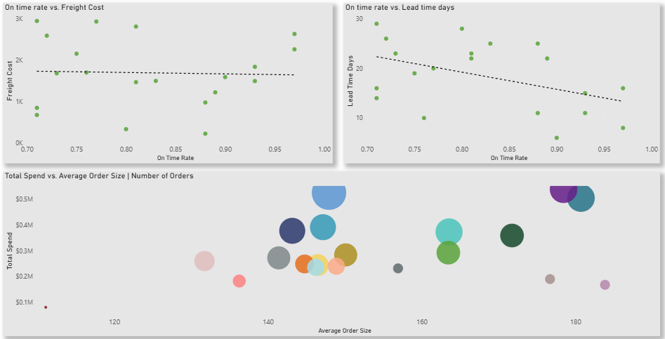

# Logistics Analytics Project – Technical Deep Dive

## 1. Overview

This document provides a technical walkthrough of the end-to-end analytics pipeline implemented in this project, consisting in three main steps:

- Synthetic data generation in Python;
- Relational modelling and transformations in SQL Server;
- Analytical modelling, DAX measures, and visualisation logic in Power BI.

The goal was to simulate a realistic logistics environment and demonstrate best practices in data engineering, analytics modelling, and insight generation.

## 2. Data Generation on Python
### 2.1 Objective

With a view to making a unique, creative project, all datasets were synthetically generated while preserving realistic logistics behaviour, particularly when it comes to:

- Supplier lead times and reliability;
- Purchase volume variability;
- Inventory inflows and outflows;
- Delivery delays.

### 2.2 Tools and Libraries

- pandas – data structures and export
- numpy – random distributions
- faker – realistic entity names
- random – controlled randomness

A fixed random seed (42) was used to ensure reproducibility.


```python
# Import libraries
import pandas as pd
import numpy as np
from faker import Faker
import random

fake = Faker()

# Set random seed for reproducibility
np.random.seed(42)
random.seed(42)

# Generate synthetic data tables

# 1. SUPPLIERS

num_suppliers = 20
suppliers = []

for i in range(1, num_suppliers + 1):
    suppliers.append({
        "supplier_id": i,
        "supplier_name": fake.company(),
        "country": fake.country(),
        "lead_time_days": np.random.randint(5, 30),
        "on_time_rate": round(np.random.uniform(0.7, 0.99), 2),
        "freight_cost": np.random.randint(200, 3000)
    })

df_suppliers = pd.DataFrame(suppliers)
df_suppliers.to_csv("suppliers.csv", index=False)


# 2. PRODUCTS

num_products = 80
products = []

for i in range(1, num_products + 1):
    products.append({
        "product_id": i,
        "product_name": fake.word().capitalize() + " " + fake.word().capitalize(),
        "category": random.choice(["Electronics", "Furniture", "Office Supplies", "Food", "Hardware"]),
        "unit_cost": round(np.random.uniform(2, 250), 2),
        "supplier_id": np.random.randint(1, num_suppliers + 1)
    })

df_products = pd.DataFrame(products)
df_products.to_csv("products.csv", index=False)


# 3. PURCHASE ORDERS

num_orders = 500
purchase_orders = []

for i in range(1, num_orders + 1):
    order_date = fake.date_between(start_date="-1y", end_date="today")
    qty = np.random.randint(10, 300)
    
    purchase_orders.append({
        "order_id": i,
        "product_id": np.random.randint(1, num_products + 1),
        "order_date": order_date,
        "quantity_ordered": qty,
        "total_cost": round(qty * np.random.uniform(5, 150), 2)
    })

df_po = pd.DataFrame(purchase_orders)
df_po.to_csv("purchase_orders.csv", index=False)


# 4. INVENTORY MOVEMENTS

num_products = 80
num_movements_per_product = 18
opening_stock = 500

inventory_movements = []
movement_id = 1

for product_id in range(1, num_products + 1):

    # OPENING BALANCE
    start_date = fake.date_between(start_date="-1y", end_date="-11m")

    inventory_movements.append({
        "movement_id": movement_id,
        "product_id": product_id,
        "movement_type": "OPENING",
        "quantity": opening_stock,
        "movement_date": start_date
    })
    movement_id += 1

    current_stock = opening_stock

    # FUTURE MOVEMENTS
    movement_dates = sorted(
        fake.date_between(start_date=start_date, end_date="today")
        for _ in range(num_movements_per_product)
    )

    for movement_date in movement_dates:

        movement_type = random.choice(["IN", "OUT"])

        if movement_type == "IN":
            qty = np.random.randint(20, 150)
            current_stock += qty

        else:  # OUT
            max_out = min(120, current_stock)
            if max_out <= 0:
                continue

            qty = np.random.randint(1, max_out + 1)
            current_stock -= qty

        inventory_movements.append({
            "movement_id": movement_id,
            "product_id": product_id,
            "movement_type": movement_type,
            "quantity": qty,
            "movement_date": movement_date
        })
        movement_id += 1

dfinv = pd.DataFrame(inventory_movements)
dfinv.to_csv("inventory_movements.csv", index=False)


# 5. DELIVERY TIMES

delivery_times = []

df_po_merged = df_po.merge(df_products[["product_id", "supplier_id"]], on="product_id", how="left")

for idx, row in df_po_merged.iterrows():
    supplier_id = row["supplier_id"]
    
    expected_lt = int(df_suppliers.loc[df_suppliers["supplier_id"] == supplier_id, "lead_time_days"].values[0])
    
    actual_lt = max(1, int(np.random.normal(expected_lt, 3)))
    
    delivery_date = pd.to_datetime(row["order_date"]) + pd.Timedelta(days=actual_lt)
    
    delivery_times.append({
        "order_id": row["order_id"],
        "product_id": row["product_id"],
        "supplier_id": supplier_id,
        "order_date": row["order_date"],
        "expected_lead_time_days": expected_lt,
        "actual_lead_time_days": actual_lt,
        "delay_days": actual_lt - expected_lt,
        "expected_delivery_date": pd.to_datetime(row["order_date"]) + pd.Timedelta(days=expected_lt),
        "actual_delivery_date": delivery_date
    })

df_deliveries = pd.DataFrame(delivery_times)
df_deliveries.to_csv("delivery_times.csv", index=False)

print("Synthetic supply-chain dataset created successfully!")

```

### 2.3 Core Tables Generated
#### Suppliers (20 rows - 20 suppliers)

Each supplier includes:

- Supplier ID
- Supplier name
- Lead time (days)
- On-time delivery rate
- Freight cost
- Country of origin

These attributes later enable correlation analysis between reliability, cost, and lead time.

#### Products (80 rows - 80 products)

Products were assigned:

- A name
- An ID
- A supplier ID
- A product category
- A unit cost

This structure supports supplier–product–category rollups in Power BI.

#### Purchase Orders (500 rows - 500 purchase orders)

Purchase orders were generated with random order dates over a 1-year window, with variable quantities and a calculated total cost. It includes:

- Order ID
- Product ID
- Order Date
- Quantity Ordered
- Total Cost

#### Inventory Movements (1517 rows - 1517 inventory movements)

An opening balance per product was initialised and OUT movements were constrained to available stock. This prevents unrealistic negative inventory at the product level.

This table includes the following columns:

- Movement ID
- Product ID
- Movement Type (OPENING - IN - OUT)
- Quantity
- Movement Date

#### Delivery Times (500 rows - 500 purchase orders)

Delivery performance was simulated independently from purchase orders using expected lead time from supplier master data, actual lead time generated via a normal distribution, and calculated delay days. This separation reflects real systems where delivery tracking is operationally distinct from procurement.

This table includes the following columns:

- Order ID
- Product ID
- Supplier ID
- Order Date
- Expected Lead Time Days
- Actual Lead Time Days
- Delay Days
- Expected Delivery Date
- Actual Delivery Date

### 2.4 EDA in Python

The datasets were explored to understand data types, distribution, and potential quality issues.

```python

# Data exploration - Delivery Times
dfdel = pd.read_csv('delivery_times.csv')
dfdel.describe()
dfdel.info()

# Data exploration - Inventory Movements
dfinv = pd.read_csv('inventory_movements.csv')
dfinv.describe()
dfinv.info()

# Data exploration - Purchase Orders
dfpo = pd.read_csv('purchase_orders.csv')
dfpo.describe()
dfpo.info()
dfpo.head()

# Data exploration - Products
dfprod = pd.read_csv('products.csv')
dfprod.describe()
dfprod.info()

# Data exploration - Suppliers
dfsupp = pd.read_csv('suppliers.csv')
dfsupp.describe()
dfsupp.info()

# Check that categories in products table don't have misspelings
dfprod.groupby('category').size()

# Create a category dimension table.
dfcategory = dfprod[['category']].drop_duplicates().reset_index(drop=True)
dfcategory['category_id'] = dfcategory.index + 1
dfcategory.head(5)

# Save category table as csv.
dfcategory.to_csv("product_categories.csv", index=False)

# Merge category_id back into Products table
dfprod = dfprod.merge(dfcategory, left_on='category', right_on='category', how='left')

# Remove category column from Products table
dfprod = dfprod.drop(columns= 'category')

# Check that the change is ok
dfprod.head()

# Save changes in products table
dfprod.to_csv("products.csv", index=False)

```

#### Product Categories (5 rows - 5 categories)
After performing EDA on my tables, I realised that normalising the products table was going to be helpful in creating a star schema in Power BI. For that reason, I created the product category table so as to avoid overloading the products table with repeated rows of category names.

### Conclusions on EDA

We can observe that the synthetically generated tables were created successfully. Thanks to observatory functions like df.info, df.head, df.describe, etc. we could determine that there is no missing data, there are not outliers and there are not duplicated values.

## 3. SQL Server Modelling
### 3.1 Database Design

All tables were loaded into a SQL Server database named Logistics.

I chose to create a star schema for my Power BI report. This design supports efficient analytical queries and modelling. For this reason, I create the following views:

```sql

-- Create a purchase orders enriched view containing information of products and delivery times.

USE Logistics
GO;

CREATE OR ALTER VIEW vw_purchase_orders_enriched AS
	SELECT po.order_id,
		po.product_id,
		po.order_date,
		po.quantity_ordered,
		po.total_cost,
		d.expected_lead_time_days,
		d.actual_lead_time_days,
		d.expected_delivery_date,
		d.actual_delivery_date,
		d.delay_days,
		CASE 
			WHEN d.delay_days > 0 THEN 'delayed'
			ELSE 'on time' -- Create a boolean column 'on_time'
		END AS on_time
	FROM dbo.purchase_orders po
	LEFT JOIN dbo.delivery_times d ON po.order_id = d.order_id
	LEFT JOIN dbo.products pr ON pr.product_id = po.product_id

-- Create an inventory movements enriched view containing columns from products, category and supplier tables

CREATE OR ALTER VIEW vw_inventory_enriched AS
	SELECT i.movement_id,
		i.product_id,
		i.movement_date,
		CASE WHEN i.movement_type = 'IN' THEN quantity
		WHEN i.movement_type = 'OPENING' THEN quantity
		ELSE -quantity
		END AS quantity -- To simplify further DAX queries, quantity is now shown as positive and negative values, getting rid of the movement type column
	FROM dbo.inventory_movements i
	LEFT JOIN dbo.products p ON i.product_id = p.product_id

```

### 3.2 Stored Procedures

2 distinct stored procedures were implemented:

```sql

-- Create a stored procedure that returns an order summary per supplier when given a date and a supplier name (parameterised filtering)

USE Logistics
GO

CREATE OR ALTER PROC dbo.usp_GetSupplierOrderSummary
	@Supplier NVARCHAR(100) = NULL,
	@Order_date DATE = NULL

AS
BEGIN
	SET NOCOUNT ON;
	SELECT s.supplier_id,
		s.supplier_name,
		s.country,
		COUNT(order_id) AS total_orders,
		ROUND(SUM(total_cost), 2) AS total_spend,
		AVG(quantity_ordered) AS avg_order_size,
		lead_time_days,
		ROUND(on_time_rate, 2) AS on_time_rate,
		freight_cost
	FROM dbo.vw_purchase_orders_enriched po
	LEFT JOIN dbo.suppliers s ON po.supplier_id = s.supplier_id
	WHERE (@Supplier IS NULL OR s.supplier_name LIKE '%' + @Supplier + '%' ) AND 
		(@Order_date IS NULL OR po.order_date >= @Order_date)
	GROUP BY s.supplier_name, s.supplier_id, s.country, on_time_rate, freight_cost, lead_time_days
END

-- Create a stored procedure that returns the running balance of every product when given a date

USE Logistics
GO

CREATE OR ALTER PROC usp_GetInventorySnapshot
	@Date DATE
AS
BEGIN
	SET NOCOUNT ON;

	WITH InventoryCTE AS (
		SELECT product_id,
		movement_date,
		quantity,
		movement_type,
		SUM(
			CASE WHEN movement_type = 'IN' THEN quantity
			 WHEN movement_type = 'OPENING' THEN quantity
			 ELSE -quantity
			 END
			 )
			OVER (PARTITION BY product_id
				ORDER BY movement_date
				ROWS BETWEEN UNBOUNDED PRECEDING AND CURRENT ROW) 
				AS running_balance
		FROM inventory_movements
		)
	SELECT p.product_id,
		p.product_name,
		COALESCE(MAX(i.running_balance), 0) AS quantity_on_hand -- Avoid NULLs if quantity on hand is 0
	FROM dbo.products p
	LEFT JOIN InventoryCTE i ON p.product_id = i.product_id
		AND i.movement_date <= @Date
	GROUP BY p.product_name, p.product_id
END


```

### Conclusions on SQL

2 views and 2 stored procedures were successfully created by using different techniques, such as Common Table Expressions (CTEs), Window functions (running totals), conditional logic, aggregations and grouping, and parameterised procedures.
This demonstrates my knowledge when it comes to reusable SQL logic, while at the same time, a backend analytics capability beyond Power BI.

## 4. Power BI analytics and reporting

### ETL on Power BI

Firstly, I created a connection between Power BI and Microsoft SQL Server in order to import the tables into Power BI. I decided to import them rather than using Direct Query due to the small size of the tables and the fact that we do not require live data updates.

Secondly, I opened up Power Query to transform my tables and made sure they are clean and correct in order to avoid inconsistencies further ahead. However, since the tables were generated synthetically, we do not expect to carry out significative transformations. 

- Rename tables, unable load of unnecessary tables, and group them as fact tables and dimension tables, as seen below:



- Dropping duplicates on my keys to assure a correct relationship between the tables.
```DAX
  = Table.Distinct(dbo_suppliers, {"supplier_id"}) 
  = Table.Distinct(#"Changed Type", {"product_id"})
  = Table.Distinct(dbo_product_categories, {"category_id"})
```
- None of the tables have errors nor empty values. 

- Creation of a date table using the following DAX:
```DAX
Dim_Date = 
ADDCOLUMNS(
    CALENDAR(DATE(2025, 1, 1), DATE(2026, 01, 31)),
    "Year", YEAR([Date]),
    "Month", FORMAT([Date], "MMM"),
    "Month Number", MONTH([Date]),
    "Year Month", FORMAT([Date], "MM-YYYY"),
    "Day Of Week", FORMAT([Date], "ddd"),
    "Day Of Week Number", WEEKDAY([Date], 2)
)

```

It supports time intelligence, monthly and yearly aggregations, slicers and trend analysis, and lastly, it avoids reliance on implicit date hierarchies.

### 4.1 Model Structure

The data model follows a star-schema design with two fact tables (purchase orders and inventory movements) connected to shared dimensions (date, product, supplier, and category). Inventory is modelled at the movement level and stock levels are calculated dynamically using cumulative DAX measures. This approach reflects real-world ERP systems and enables flexible time-based inventory analysis. Key columns have been identified as such; and the date table have been marked as such to override any automatic hierarchical dates in Power BI.



## 5. DAX Measures and KPIs
   ### 5.1 Inventory Logic

- Closing stock balance: Returns inventory as of the selected date context.
Since the column quantities in the fact inventory table is signed, then SUM(quantity) = net movement. However, running balances have been calculated via date-aware measures so that the KPI will vary when different filters are selected.

```DAX
Closing Stock Balance = 
VAR AxisDate =
    MAX(Dim_Date[Date])

VAR MinSlicerDate =
    MINX(ALLSELECTED(Dim_Date), Dim_Date[Date])

VAR MaxSlicerDate =
    MAXX(ALLSELECTED(Dim_Date), Dim_Date[Date])

RETURN
IF(
    AxisDate < MinSlicerDate
        || AxisDate > MaxSlicerDate,
    BLANK(),
    CALCULATE(
        SUM(Fact_Inventory[quantity]),
        FILTER(
            ALLSELECTED(Dim_Date),
            Dim_Date[Date] <= AxisDate
        )
    )
)
```

- Average Daily OUT: Calculates average daily consumption using date-aware iteration, taking only negative quantities (OUT)

```DAX
AverageDailyOut = AVERAGEX(
    FILTER(
        VALUES(Dim_Date[Date]), 
        [TotalOut] > 0), [TotalOut])
```

- Days of Inventory Coverage: Indicates how long current stock would last at current consumption rates.

```DAX
Days Of Inventory Coverage = 
VAR DailyOut = CALCULATE(SUM(Fact_Inventory[quantity]), Fact_Inventory[quantity] < 0) * -1

VAR AverageDailyOut = AVERAGEX(FILTER(VALUES(Dim_Date[Date]), [TotalOut] > 0), [TotalOut])

RETURN DIVIDE([Closing Stock Balance], AverageDailyOut)
```

- % Days Below Safety Stock: Returns a percentage value of the days when inventory value was below safety stock (500 units chosen randomly) within the selected time period. 

```DAX
% Days below Safety Stock = 
VAR DaysBelowSafetyStock = CALCULATE(COUNTROWS(Dim_Date), FILTER(Dim_Date, [Closing Stock Balance] < 500))
VAR TotalDays = COUNTROWS(Dim_Date)

RETURN DIVIDE(DaysBelowSafetyStock, TotalDays)
```

### 5.2 Performance KPIs

- Total Spend

```DAX
Total Spend = SUM(Fact_Purchase_Order[total_cost])
```

- Average Delay (days): Calculates the average delay days only including the days marked as 'delayed', i.e: when delay days > 0.

```DAX
Average Delay = 
CALCULATE(
    AVERAGE(Fact_Purchase_Order[delay_days]),
    Fact_Purchase_Order[on_time] = "delayed"
)
```

- Average On-Time Rate

```DAX
Average On Time Rate = AVERAGE(Dim_Supplier[on_time_rate])
```

All KPIs and measures created respond well to drill down and filters.

## 6. Visual Design \& Interactivity
   ### 6.1 Report structure

The report is split into logical sections:

- **Main dashboard**: An operational overview of the logistics department, allowing tracking of purchase costs, supplier performance, inventory snapshots and expense trends.


- **Supplier analysis**: Allows supplier performance analysis identifying 4 clear quadrants:

A. **Strategic Suppliers (green bubbles)**: These suppliers combine high financial impact with strong delivery performance, making them ideal candidates for strategic partnerships.

B. **High Risk Suppliers (red bubbles)**: A subset of suppliers that are critical to operations but highly unreliable.

C. **Non Core Suppliers (blue bubbles)**: Low-spend, low-reliability suppliers that contribute limited value and may be candidates for consolidation.

D. **Emerging / Growth Suppliers (pink bubbles)**: Highly reliable but low-spend suppliers that represent potential alternatives to reduce dependency on underperforming high-spend suppliers.

It also allows filtering by category, modifying the position of the bubbles dynamically. It is important to say that some suppliers, when filtered by category, are positioned in less quadrants due to spend distribution.



The quadrants' colours have been made possible by the following DAX measure that dynamically changes bubbles' colours depending on which quadrant the supplier falls into:

```DAX
Quadrants Colour = -- Returns a colour depending on which quadrant the supplier falls into
VAR OnTimeRate = [Average On Time Rate]
VAR TotalSpend = [Total Spend]

VAR AvgOnTimeRate_AllSuppliers =
    CALCULATE(
        [Average On Time Rate],
        ALL(Dim_Supplier)
    )

VAR AvgSpend_AllSuppliers =
    CALCULATE(
        MEDIANX(ALL(Dim_Supplier), [Total Spend]) -- Median instead of average to avoid skew from high-spend outliers
    )

RETURN
SWITCH(
    TRUE(),
    OnTimeRate >= AvgOnTimeRate_AllSuppliers && TotalSpend >= AvgSpend_AllSuppliers, 1,   -- Strategic
    OnTimeRate <  AvgOnTimeRate_AllSuppliers && TotalSpend >= AvgSpend_AllSuppliers, 2,   -- High Risk
    OnTimeRate <  AvgOnTimeRate_AllSuppliers && TotalSpend <  AvgSpend_AllSuppliers, 3,   -- Non-core
    OnTimeRate >= AvgOnTimeRate_AllSuppliers && TotalSpend <  AvgSpend_AllSuppliers, 4    -- Emerging
)
```

- **Correlation analysis**: Its main function is to study the relationship between different variables. *On-time rate vs. freight cost* and *on-time rate vs. lead time* correlations allows for patterns discoveries. Further down on the page, there is a bubble chart showing one bubble per supplier, and their positions depending on the average order size and the total spend. Their size is determined by the number of orders, a visual cue designed to easily identify drivers for total spend.



### 6.2 Visual Techniques

- Waterfall chart chosen to accurately represent spend decomposition among suppliers, instead of a simple bar/column chart. A drill down capability offers precise analysis by supplier, category, and product. The chart's tooltip enables a further detailed pie chart showing orders status proportion between on-time and delayed orders.

- Line and area charts for trends for both inventory levels and spend. Average lines are used to add context to the trends, and a safety stock line is used to pinpoint exact times where inventory levels are suboptimal.

- Scatter plots for correlation analysis. 

- Conditional formatting on the % of Days below Safety stock KPI for risk highlighting.

- Bookmarks for filter control that show/hide filters to avoid cluttering the dashboard and allow the viewer to focus on the charts. Two additional information icons have been positioned to further clarify KPIs.

## 7. Insights

### Spend and Demand
Total spend is relatively well distributed across suppliers, reducing dependency risk. However, monthly spend shows high variability, indicating opportunities for better demand planning and purchase smoothing.

### Inventory
Total inventory coverage exceeds 300 days, suggesting significant overstocking. As a consequence, holding costs increase, as well as warehouse space usage and obsolescence risk.
Frequent inventory fluctuations highlight potential misalignment between purchasing and consumption.

### Supplier Performance
Delayed orders are common, though the average delay remains modest (≈ 2–4 days).
There is no meaningful correlation between freight cost and on-time delivery, suggesting higher freight spend does not guarantee reliability.
A negative correlation exists between lead time and on-time rate. That means shorter lead times improve delivery reliability.

### Spend Drivers
Most suppliers cluster around a similar average order size. However, order size alone does not drive total spend. On the contrary, number of orders is the primary driver of total spend, as evidenced by larger bubbles corresponding to higher spend.

## 8. Limitations and Assumptions

- Data is synthetic and illustrative    

- Safety stock thresholds are assumed

- No real operational constraints (MOQ, batching, contracts)

- These limitations are explicitly acknowledged to avoid over-interpretation.

## 9. Next steps

This projects has a lot of room to grow. It would be ideal to simulate a reorder point in the fact inventory table so that it becomes a more realistic approaching to analysing inventory.
Furthermore, we could analyse suppliers by cluster instead of individually by assigning them a spend-risk score.
Likewise, an ABC / XYZ inventory segmentation approach is likely to pave the way to unlocking further insights.

## 10. Conclusion

This project demonstrates a production-style analytics workflow, from data generation through modelling to insight communication.

It emphasizes:

- Analytical correctness

- Modelling discipline

- Business relevance

- Clear storytelling

